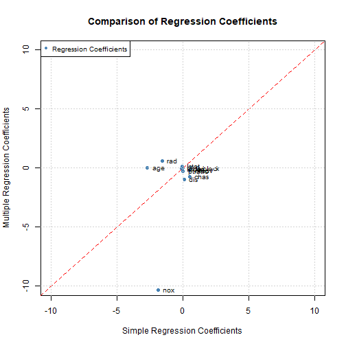

```r
knitr::opts_chunk$set(echo = TRUE)
library(MASS)
data("Boston")
```

## Question 1


```r
# Create an empty vector to store the results
significant_models <- vector("logical", length = 13)

# Fit simple linear regression models for each predictor
for (i in 2:13) {
  predictor <- Boston[, i]
  model <- lm(crim ~ predictor, data = Boston)
  
  # Check if the p-value for the predictor is less than 0.05
  if (summary(model)$coefficients[2, "Pr(>|t|)"] < 0.05) {
    significant_models[i] <- TRUE
  }
}

# Print the predictors with a statistically significant association
significant_predictors <- names(Boston)[significant_models]
cat("Predictors with a statistically significant association:\n")
```

```
## Predictors with a statistically significant association:
```

```r
cat(significant_predictors, sep = ", ")
```

```
## zn, indus, nox, rm, age, dis, rad, tax, ptratio, black, lstat
```

#### 1a. 
[This code loops over each predictor in the Boston dataset, fits a simple linear regression model using that predictor, and checks if the p-value for the predictor is less than 0.05. If the p-value is less than 0.05, it means there is a statistically significant association between the predictor and the response (per capita crime rate). The names of the predictors with a statistically significant association are then printed.]

#### 1b.
[We then find that Predictors with a statistically significant association are zn, indus, nox, rm, age, dis, rad, tax, ptratio, black, lstat]

## Question 2

```r
# Fit multiple regression model using all features
model <- lm(crim ~ ., data = Boston)

# Obtain the p-values for each feature
p_values <- summary(model)$coefficients[, "Pr(>|t|)"]

# Identify features with significant associations (rejecting the null hypothesis)
significant_features <- names(Boston)[p_values < 0.05]

# Print the features with significant associations
cat("Features with a significant association (rejecting the null hypothesis):\n")
```

```
## Features with a significant association (rejecting the null hypothesis):
```

```r
cat(significant_features, sep = ", ")
```

```
## crim, zn, dis, rad, black, medv
```

#### 2a.
[In this code, a multiple regression model is fitted using the lm() function, where crim is the response variable and . indicates all the other features in the dataset are used as predictors.

The p-values for each feature are obtained from the summary(model)$coefficients[, "Pr(>|t|)"] statement. The p-value represents the significance of each coefficient, and if the p-value is less than 0.05, we can reject the null hypothesis H_0: β_j = 0, indicating a significant association between the feature and the response.

The names of the features with significant associations are stored in the significant_features variable and then printed.]

## Question 3

```r
# Fit simple linear regression models for each predictor
simple_reg_coeffs <- vector("numeric", length = 13)
for (i in 2:13) {
  predictor <- Boston[, i]
  model <- lm(crim ~ predictor, data = Boston)
  simple_reg_coeffs[i] <- coef(model)[2]  # Store the regression coefficient
}

# Fit multiple regression model using all features
multiple_reg_coeffs <- coef(lm(crim ~ ., data = Boston))

# Create a scatterplot
plot(simple_reg_coeffs, multiple_reg_coeffs[-1], 
     xlab = "Simple Regression Coefficients", ylab = "Multiple Regression Coefficients",
     main = "Comparison of Regression Coefficients",
     xlim = c(-10, 10), ylim = c(-10, 10),
     col = "steelblue", pch = 16)

# Add a line of equality
abline(a = 0, b = 1, col = "red", lty = 2)

# Add labels for each predictor with an offset
text(simple_reg_coeffs, multiple_reg_coeffs[-1], labels = names(Boston)[-1], pos = 4, cex = 0.8, offset = 0.5)

# Add gridlines
grid()

# Add legend
legend("topleft", legend = "Regression Coefficients", col = "steelblue", pch = 16, cex = 0.8)
```



## Question 4

```r
# Select variables of interest
variables_of_interest <- c("zn", "dis", "rad", "black", "medv")

# Create an empty vector to store the p-values for the cubic model
p_values_cubic <- vector("numeric", length = length(variables_of_interest))

# Fit cubic models for each variable
for (i in 1:length(variables_of_interest)) {
  predictor <- Boston[, variables_of_interest[i]]
  
  # Fit the cubic model
  cubic_model <- lm(crim ~ predictor + I(predictor^2) + I(predictor^3), data = Boston)
  
  # Extract the p-value for the cubic term
  p_value <- summary(cubic_model)$coefficients[4, "Pr(>|t|)"]
  
  # Store the p-value
  p_values_cubic[i] <- p_value
  
  # Print the p-value for the cubic term
  cat("Variable:", variables_of_interest[i], "\t p-value for cubic term:", p_value, "\n")
}
```

```
## Variable: zn 	 p-value for cubic term: 0.2295386 
## Variable: dis 	 p-value for cubic term: 1.088832e-08 
## Variable: rad 	 p-value for cubic term: 0.4823138 
## Variable: black 	 p-value for cubic term: 0.5436172 
## Variable: medv 	 p-value for cubic term: 1.04651e-12
```

```r
# Identify variables with a significant cubic relationship
significant_cubic_predictors <- variables_of_interest[p_values_cubic < 0.05]

# Print the variables with a significant cubic relationship
cat("\nVariables with a significant cubic relationship:\n")
```

```
## 
## Variables with a significant cubic relationship:
```

```r
cat(significant_cubic_predictors, sep = ", ")
```

```
## dis, medv
```
[In this code, we iterate over each predictor in the Boston dataset and fit a cubic model using the lm() function. The model includes the predictor, its squared term (I(predictor^2)), and its cubed term (I(predictor^3)).

We then extract the p-value for the cubic term from the summary of the cubic model using summary(cubic_model)$coefficients[4, "Pr(>|t|)"] and store it in the p_values_cubic vector.

The code prints the predictor name and its corresponding p-value for the cubic term. A significant p-value (typically less than 0.05) indicates evidence of a non-linear relationship between the predictor and the response variable.

Finally, we identify the predictors with a significant cubic relationship by filtering the names of the Boston dataset using p_values_cubic < 0.05 and print them out.]
